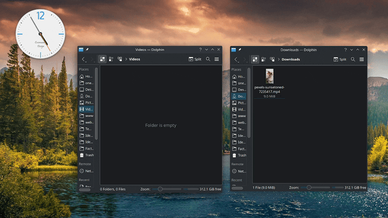

# Auto video thunbnail

Watch and resize all the videos you deposit in one folder.



# Install

1) Install Java.

Debian/Ubuntu

``` bash
sudo apt install default-jdk ffmpeg
```

Mac OS

``` bash
brew install openjdk
```

2) Create `config.yaml`.

``` bash
extension_thumbnail: "_thumbnail.mp4"
width_thumbnail: 600
path_videos: "videos"
audio_quality_thumbnail: 128
```

3) Make folder `path_videos`.

``` bash
mkdir videos
```

4) Install `ffmpeg`.

5) Download the latest version (`video-optimize-{version}-SNAPSHOT-standalone.jar`).

https://github.com/tanrax/auto-video-thumbnail/releases


6) Now you can execute.

``` bash
java -jar video-optimize-{version}-SNAPSHOT-standalone.jar
```

or

``` bash
java $JVM_OPTS -cp video-optimize-{version}-SNAPSHOT-standalone.jar clojure.main -m video-optimize.core
```

7) Leave videos in folder `videos`.

Everything you leave in the videos folder will be optimized for web with the specified resolution (600px in this example).

example.mp4 -> example_thumbnail.mp4
